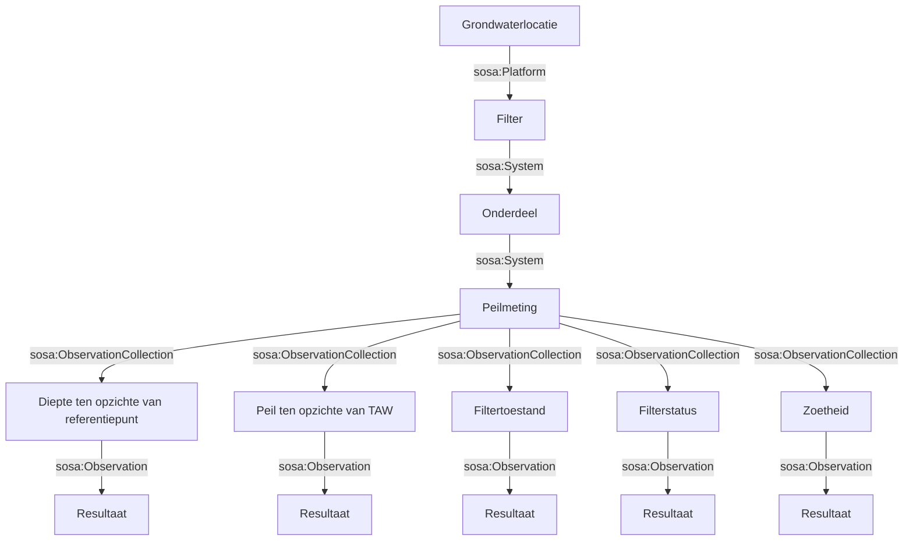

# Grondwaterpeilmetingen Transformatie

Dit document beschrijft de transformatie van grondwaterpeilmetingen uit het `source.xml` bestand naar RDF/XML en Turtle formaat met behulp van XSLT en Apache Jena RIOT. De transformatie maakt gebruik van de SOSA (Sensor, Observation, Sample, and Actuator) ontologie om de peilmetingen semantisch te beschrijven.

## Inhoudsopgave
- [Bronbestand](#bronbestand)
- [Transformatie Proces](#transformatie-proces)
- [Mapping Keuzes](#mapping-keuzes)
- [Grafische Voorstelling](#grafische-voorstelling)
- [Output Bestanden](#output-bestanden)
- [Validatie](#validatie)
- [Gebruik](#gebruik)

## Bronbestand
Het bronbestand `source.xml` bevat grondwaterpeilmetingen in XML-formaat. Het bestand bevat informatie over:
- Grondwaterlocaties
- Filters
- Peilmetingen

## Transformatie Proces
De transformatie wordt uitgevoerd in twee stappen:
1. **XSLT Transformatie**: Het `source.xml` bestand wordt getransformeerd naar RDF/XML met behulp van het `transformatie.xslt` bestand.
2. **Conversie naar Turtle**: Het gegenereerde RDF/XML bestand wordt omgezet naar Turtle formaat met behulp van Apache Jena RIOT.

## Mapping Keuzes
De transformatie maakt gebruik van de volgende mapping keuzes:

### Grondwaterlocatie
- **Type**: `sosa:Platform`
- **Eigenschappen**:
  - `geo:hasGeometry`: Bevat de geometrie van de locatie als een GML punt.
  - `geo:asGML`: Bevat de GML representatie van het punt.

### Filter
- **Type**: `sosa:System`
- **Eigenschappen**:
  - `sosa:isHostedBy`: Relatie met de grondwaterlocatie.
  - `dct:author`: Auteur van het filter.
  - `rdfs:comment`: Opmerkingen over het filter.

### Onderdeel
- **Type**: `sosa:System`
- **Eigenschappen**:
  - `sosa:isHostedBy`: Relatie met de grondwaterlocatie.
  - `sosa:isSubSystemOf`: Relatie met het filter.
  - `ex:van`: Begin van het onderdeel.
  - `ex:tot`: Einde van het onderdeel.
  - `ex:filterelement`: Type filterelement.
  - `ex:materiaal`: Materiaal van het onderdeel.
  - `ex:binnendiameter`: Binnendiameter van het onderdeel.

### Peilmeting
- **Type**: `sosa:ObservationCollection`
- **Eigenschappen**:
  - `sosa:hasMember`: Bevat individuele observaties voor verschillende eigenschappen.
  - `sosa:madeBySensor`: Sensor die de meting heeft uitgevoerd.
  - `sosa:hasFeatureOfInterest`: Feature of interest (grondwaterlocatie).
  - `sosa:resultTime`: Tijdstip van de meting.

### Individuele Observaties
Elke peilmeting bevat meerdere observaties voor verschillende eigenschappen:

#### Diepte ten opzichte van referentiepunt
- **Type**: `sosa:Observation`
- **Eigenschappen**:
  - `sosa:hasResult`: Resultaat van de observatie.
  - `sosa:observedProperty`: Waargenomen eigenschap (`ex:diepte_tov_referentiepunt`).
  - `sosa:usedProcedure`: Gebruikte procedure (`ex:peillint_methode`).

#### Peil ten opzichte van TAW
- **Type**: `sosa:Observation`
- **Eigenschappen**:
  - `sosa:hasResult`: Resultaat van de observatie.
  - `sosa:observedProperty`: Waargenomen eigenschap (`ex:peil_mtaw`).
  - `sosa:usedProcedure`: Gebruikte procedure (`ex:peillint_methode`).

#### Filtertoestand
- **Type**: `sosa:Observation`
- **Eigenschappen**:
  - `sosa:hasSimpleResult`: Resultaat van de observatie.
  - `sosa:observedProperty`: Waargenomen eigenschap (`ex:filtertoestand`).
  - `sosa:usedProcedure`: Gebruikte procedure (`ex:visueel_methode`).

#### Filterstatus
- **Type**: `sosa:Observation`
- **Eigenschappen**:
  - `sosa:hasSimpleResult`: Resultaat van de observatie.
  - `sosa:observedProperty`: Waargenomen eigenschap (`ex:filterstatus`).
  - `sosa:usedProcedure`: Gebruikte procedure (`ex:visuele_controle`).

#### Zoetheid
- **Type**: `sosa:Observation`
- **Eigenschappen**:
  - `sosa:hasSimpleResult`: Resultaat van de observatie.
  - `sosa:observedProperty`: Waargenomen eigenschap (`ex:zoet`).
  - `sosa:usedProcedure`: Gebruikte procedure (`ex:smaaktest`).

## Grafische Voorstelling



## Validatie
De gegenereerde output bestanden kunnen worden gevalideerd met behulp van Apache Jena RIOT:
```bash
riot --validate grondwaterpeilmetingen.rdf
riot --validate grondwaterpeilmetingen.ttl
```

## Gebruik
Om de transformatie uit te voeren, voer het volgende script uit:
```bash
chmod +x transform.sh
./transform.sh
```

Het script voert de volgende stappen uit:
1. XSLT-transformatie van `source.xml` naar `grondwaterpeilmetingen.rdf`
2. Conversie van `grondwaterpeilmetingen.rdf` naar `grondwaterpeilmetingen.ttl` (Turtle formaat)
3. Uitvoeren van de SPARQL query op `grondwaterpeilmetingen.ttl` om een CSV bestand te genereren met observatierecords

### Output Bestanden
De transformatie genereert de volgende output bestanden:
- `grondwaterpeilmetingen.rdf`: RDF/XML output van de XSLT-transformatie.
- `grondwaterpeilmetingen.ttl`: Turtle output van de conversie.
- `grondwaterpeilmetingen.csv`: CSV output met observatierecords.

### SPARQL Query
De SPARQL query die wordt gebruikt om de CSV output te genereren, is opgeslagen in `query.sparql`. Deze query selecteert observatierecords en slaat deze op in een tabelvorm.