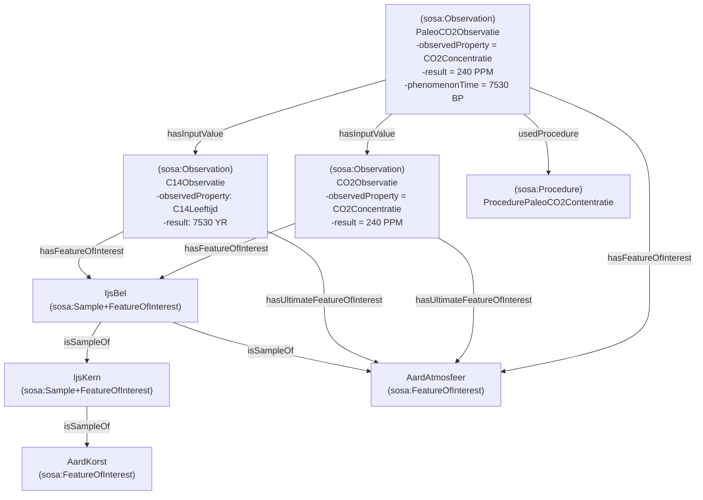
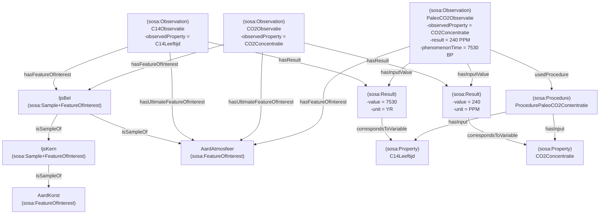

# Paleo atmosfeer

De concentratie van CO₂ kan worden gemeten in luchtbellen in ijskernen, waarvan wordt aangenomen dat ze een steekproef vormen van de atmosfeer op een bepaald moment in het verleden. In dit geval zijn de concentratie en de leeftijd het resultaat van twee oorspronkelijke waarnemingen. Deze leveren de invoerwaarden voor de uiteindelijke waarneming.

## Alternatief 1
In dit voorbeeld zijn de 2 oorspronkelijke observaties (i.e de executions, de activiteiten) direct gelinkt met de uiteindelijke observatie.

## Alternatief 2
In dit voorbeeld worden de resultaten van de 2 oorspronkelijke observaties gelinkt met de uiteindelijke observatie (niet de observaties zelf).
Deze 2 resultaten komen overeen met de input variabelen gedefinieerd in de procedure.

#### Opmerking:
De 2 input variabelen zijn in dit voorbeeld apart gedefinieerd. Dit is niet noodzakelijk. We zouden als input variabelen de 2 overeenkomende observedProperties kunnen specifieren.
- ex:VariabeleCO2Observatie --> ex:CO2Concentratie
- ex:VariabeleC14Observatie --> ex:C14Leeftijd

