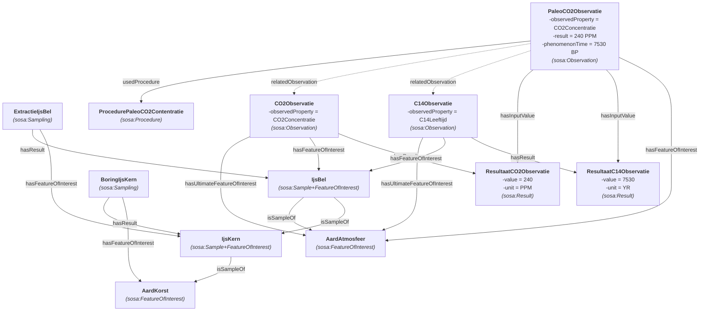
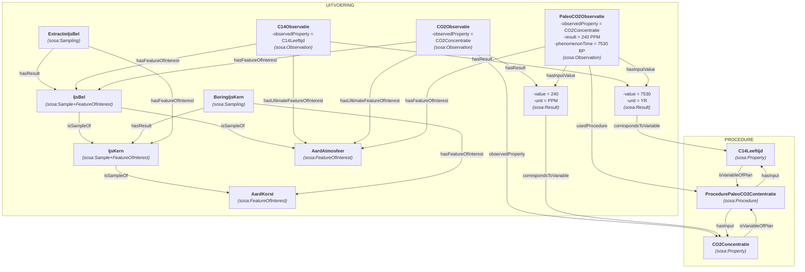

# Paleo atmosfeer

De concentratie van CO₂ kan worden gemeten in luchtbellen in ijskernen, waarvan wordt aangenomen dat ze een steekproef vormen van de atmosfeer op een bepaald moment in het verleden. In dit geval zijn de concentratie en de leeftijd het resultaat van twee oorspronkelijke waarnemingen. Deze leveren de invoerwaarden voor de uiteindelijke waarneming.

## Bemonsteringsketen
Beide alternatieven delen dezelfde bemonsteringsketen (R8): `IjsBel isSampleOf IjsKern isSampleOf AardKorst`. Elk monster is het resultaat van een `sosa:Sampling`: de boring van de ijskern (FOI de aardkorst) en de extractie van de luchtbel (FOI de ijskern). Zo is elk studieobject in de keten het FOI van een uitvoering, zoals SOSA vraagt. Alle FOI's dragen ook de inverse `sosa:isFeatureOfInterestOf`, omdat de SHACL-validatie op het niet-afgeleide model gebeurt.

## Alternatief 1
In dit voorbeeld krijgt de uiteindelijke observatie de **resultaten** van de 2 oorspronkelijke observaties als inputwaarden (`sosa:hasInputValue`). Ze verwijst naar de oorspronkelijke observaties zelf met `sosa:relatedObservation`. Er zijn geen p-plan-variabelen: de procedure beschrijft haar inputs enkel in tekst.

#### Waarom niet `hasInputValue` naar de observaties?
SOSA 2023 definieert `sosa:hasInputValue` als "kent een waarde toe aan een input, gedefinieerd door de Procedure, die gebruikt wordt in een Execution". Een inputwaarde is dus een waarde, een `prov:Entity`: de tegenhanger van `sosa:hasResult` (⊂ `prov:generated`). In `src/main/resources/ontologies/pplan-sosa.ttl` is `sosa:hasInputValue` daarom een subproperty van `prov:used`.

Een observatie is een activiteit (`sosa:Execution` ⊂ `prov:Activity`), en `prov:Activity` is disjunct met `prov:Entity`. Een observatie als inputwaarde maakt het model dus inconsistent. De pipeline meldt dat als `[MODEL INVALID]`. De vorige versie van dit alternatief deed precies dat; ze is op 2026-10-01 rechtgezet.

## Alternatief 2
Zoals in alternatief 1 zijn de resultaten van de 2 oorspronkelijke observaties de inputwaarden van de uiteindelijke observatie. Daarnaast worden ze met `p-plan:correspondsToVariable` gekoppeld aan de inputvariabelen van de procedure (`sosa:hasInput`). Zo is ook af te leiden welke procedure gebruikt werd (keten `hasInputValue ∘ correspondsToVariable ∘ inputFor ⊑ usedProcedure` in `pplan-sosa.ttl`).

#### Opmerking:
De 2 input variabelen zijn in dit voorbeeld apart gedefinieerd. Dit is niet noodzakelijk. We zouden als input variabelen de 2 overeenkomende observedProperties kunnen specifieren.
- ex:VariabeleCO2Observatie --> ex:CO2Concentratie
- ex:VariabeleC14Observatie --> ex:C14Leeftijd

