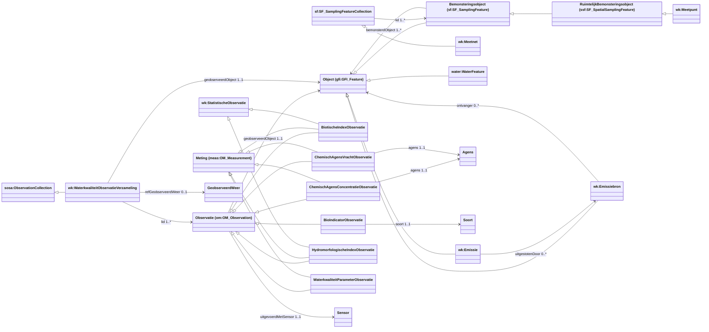

# Bestaand model: OSLO Waterkwaliteit (kandidaatstandaard 2023-06-01)

## 1. Situering

| | |
|---|---|
| Applicatieprofiel | <https://data.vlaanderen.be/doc/applicatieprofiel/waterkwaliteit/kandidaatstandaard/2023-06-01> |
| Status | Kandidaatstandaard, **niet goedgekeurd** |
| Editors | Digitaal Vlaanderen |
| Vocabularium | `wk:` = `https://data.vlaanderen.be/ns/waterkwaliteit#` |
| SHACL | [`shacl.trig`](shacl.trig): 60 `sh:NodeShape`s, alle `sh:closed false` |

Het applicatieprofiel beschrijft hoe waterkwaliteitsobservaties (chemisch, fysisch, biologisch en
hydromorfologisch), meetpunten, meetnetten en emissies uitgewisseld worden. Het model bouwt verder
op **OSLO Observaties en Metingen**, en dat volgt op zijn beurt de **ISO 19156:2011 (O&M)**-UML.
SOSA/SSN-termen komen maar op een paar plaatsen voor. Dit document beschrijft het model zoals het
in de SHACL staat en duidt aan waar het afwijkt van een standaard SSN/SOSA 2023-model.

> **Grootste probleem:** het model steunt voor zijn kern op namespaces die niet (meer) bruikbaar
> zijn als normatieve basis:
>
> | Namespace | Status | Gebruik in `shacl.trig` |
> |---|---|---|
> | `http://def.isotc211.org/…` | **Verwijderd.** Het was een automatische UML-naar-RDF-omzetting die de OGC op vraag van Digitaal Vlaanderen heeft weggehaald. | 40 verschillende IRI's (kern van Observatie, Bemonsteringsobject, tijd, maat, kwaliteit, metadata) |
> | `https://data.vlaanderen.be/ns/observaties-en-metingen#` | **Deprecated** | 6 IRI's (identificatoren, uitgevoerdDoor, waardeverschaffer, Observatiecontext) |
> | `https://data.vlaanderen.be/ns/generiek#` | **Niet onderworpen aan review** | 5 IRI's (Opmeting, opmeting, methode, uitgevoerdDoor, WettelijkKader) |
> | `https://purl.eu/ns/air-and-water/water#` | Kandidaatstandaard (2021-10-01), Europees (ODALA). **Geen machineleesbare definitie gepubliceerd**, en zelf gebouwd op `def.isotc211.org`. | 15 IRI's (4 observatieklassen, WaterFeature, resultaat- en observedProperty-properties) |
>
> Zie §4.1, §4.2 en §4.3.

Gebruikte prefixen in dit document:

| Prefix | Namespace |
|---|---|
| `wk:` | `https://data.vlaanderen.be/ns/waterkwaliteit#` |
| `water:` | `https://purl.eu/ns/air-and-water/water#` |
| `om:` | `http://def.isotc211.org/iso19156/2011/Observation#` |
| `sf:` | `http://def.isotc211.org/iso19156/2011/SamplingFeature#` |
| `ssf:` | `http://def.isotc211.org/iso19156/2011/SpatialSamplingFeature#` |
| `gfi:` | `http://def.isotc211.org/iso19156/2011/GeneralFeatureInstance#` |
| `meas:` | `http://def.isotc211.org/iso19156/2011/Measurement#` |
| `iso19103:` | `http://def.isotc211.org/iso19103/2005/` |
| `tm:` | `http://def.isotc211.org/iso19108/2006/TemporalObjects#` |
| `gf:` | `http://def.isotc211.org/iso19109/2005/GeneralFeatureModel#` |
| `dq:` | `http://def.isotc211.org/iso19115/2006/DataQualityInformation#` |
| `md:` | `http://def.isotc211.org/iso19115/2006/MetadataEntitySetInformation#` |
| `oem:` | `https://data.vlaanderen.be/ns/observaties-en-metingen#` (deprecated) |
| `gen:` | `https://data.vlaanderen.be/ns/generiek#` (niet gereviewd) |
| `sosa:` / `ssn:` | `http://www.w3.org/ns/sosa/` / `http://www.w3.org/ns/ssn/` |
| `locn:`, `adms:`, `dct:`, `skos:`, `prov:`, `geo:` | standaard W3C/SEMIC-namespaces |

---

## 2. Klassendiagram (overzicht)

Hiërarchie volgens de AP-documentatie. De subklasse-relaties staan **niet** in de SHACL.

---

## 3. Kernklassen en hun eigenschappen

Kardinaliteiten en bereiken komen uit `shacl.trig`. Per eigenschap maakt de generator twee
property shapes aan (een met `sh:class`, een met `sh:minCount`/`sh:maxCount`). Hieronder staan ze
samengevoegd.

### 3.1 Observatie (`om:OM_Observation`, generieke O&M-observatie)

| Eigenschap | Pad | Kard. | Bereik |
|---|---|---|---|
| geobserveerdObject | `om:OM_Observation.featureOfInterest` | 1..1 | `gfi:GFI_Feature` |
| geobserveerdKenmerk | `om:OM_Observation.observedProperty` | 1..1 | `gf:GF_PropertyType` |
| resultaat | `om:OM_Observation.result` | 1..1 | `rdfs:Resource` |
| fenomeentijd | `om:OM_Observation.phenomenonTime` | 1..1 | `tm:TM_Object` |
| resultaattijd | `om:OM_Observation.resultTime` | 1..1 | `tm:TM_Instant` |
| geldigeTijd | `om:OM_Observation.validTime` | 0..1 | `tm:TM_Period` |
| uitgevoerdMetSensor | `sosa:madeBySensor` | **1..1** | `sosa:Sensor` |
| gebruikteProcedure | `sosa:usedProcedure` | 0..* | `sosa:Procedure` |
| uitgevoerdDoor | `oem:Observatie.uitgevoerdDoor` | 0..* | `dct:Agent` |
| parameter | `om:OM_Observation.parameter` | 0..* | `om:NamedValue` |
| resultaatkwaliteit | `om:OM_Observation.resultQuality` | 0..* | `dq:DQ_Element` |
| metadata | `om:OM_Observation.metadata` | 0..1 | `md:MD_Metadata` |
| geassocieerdeObservatie | `om:ObservationContext.relatedObservation` | 0..* | `om:OM_Observation` |
| identificator | `oem:Observatie.identificator` | 0..* | `adms:Identifier` |
| type | `dct:type` | 0..* | `skos:Concept` |

Observaties kunnen ook via een reïficeerde **Observatiecontext** (`om:ObservationContext`) aan
elkaar gekoppeld worden: `source` 1..1, `target` 1..1 en `rol` 1..1 (`iso19103:GenericName`).

### 3.2 Gespecialiseerde waterkwaliteitsobservaties

Elke subklasse krijgt een **eigen resultaatproperty** en een **eigen observedProperty-IRI**. De
generieke `resultaat` en `geobserveerdKenmerk` worden dus niet hergebruikt.

| Klasse | Superklassen | Resultaat (pad, 1..1) | geobserveerdKenmerk (pad, 1..1) | Extra |
|---|---|---|---|---|
| `water:ChemicalAgentConcentrationObservation` (ChemischAgensConcentratieObservatie) | Observatie, Meting | `water:…chemicalAgentConcentration` → `iso19103:Measure` | `water:…observedProperty` → `wk:ChemischAgensKenmerkType` | `wk:ChemischAgensConcentratieObservatie.agens` → `wk:Agens` 1..1 |
| `wk:ChemischAgensVrachtObservatie` | Observatie, Meting | `wk:chemischAgensVracht` → `iso19103:Measure` | `wk:ChemischAgensVrachtObservatie.geobserveerdKenmerk` → `wk:ChemischAgensKenmerkType` | `wk:ChemischAgensVrachtObservatie.agens` → `wk:Agens` 1..1 |
| `water:WaterQualityParameterObservation` (WaterkwaliteitParameterObservatie) | Observatie, Meting | `water:…waterQualityParameterResult` → `iso19103:Measure` | `water:…observedProperty` → `skos:Concept` | – |
| `water:BioticIndexObservation` (BiotischeIndexObservatie) | Observatie, Meting, StatistischeObservatie | `water:…bioticIndex` → `iso19103:Measure` | `water:…observedProperty` → `skos:Concept` | – |
| `wk:HydromorfologischeIndexObservatie` | Observatie, Meting, StatistischeObservatie | `wk:hydromorfologischeIndex` → `iso19103:Measure` | `wk:HydromorfologischeIndexObservatie.geobserveerdKenmerk` → `skos:Concept` | – |
| `water:BioIndicatorObservation` (BioIndicatorObservatie) | Observatie | `water:…bioIndicator` → `rdfs:Resource` | `water:…observedProperty` → `skos:Concept` | `wk:soort` → `wk:Soort` 1..1 |
| `wk:StatistischeObservatie` | (abstract) | – | – | lege shape |
| `wk:GeobserveerdWeer` | – | – | – | lege shape |

**Wat bestudeerd wordt, wordt op twee manieren uitgedrukt.** Bij chemische observaties gaat het om
de combinatie *agens* (bv. nitraat, als `wk:Agens`) × *kenmerktype* (bv. concentratie, als
`wk:ChemischAgensKenmerkType`). Bij biologische observaties is het *soort* × *kenmerk*. Het agens
en de soort staan op de observatie zelf, niet in de ObservableProperty.

### 3.3 WaterkwaliteitObservatieVerzameling (`wk:`, subklasse van `sosa:ObservationCollection`)

| Eigenschap | Pad | Kard. | Bereik |
|---|---|---|---|
| lid | `https://www.w3.org/ns/sosa/hasMember` ⚠ | 1..* | `om:OM_Observation` |
| geobserveerdObject | `sosa:hasFeatureOfInterest` | 1..1 | `gfi:GFI_Feature` |
| fenomeentijd | `sosa:phenomenonTime` | 1..1 | `tm:TM_Object` |
| refGeobserveerdWeer | `water:WaterQualityObservationCollection.refWeatherObserved` | 0..1 | `wk:GeobserveerdWeer` |

### 3.4 Bemonstering: Meetpunt, Meetnet

| Klasse | Eigenschap | Pad | Kard. | Bereik |
|---|---|---|---|---|
| Bemonsteringsobject (`sf:SF_SamplingFeature`) | bemonsterdObject | `sf:SF_SamplingFeature.sampledFeature` | 1..* | `gfi:GFI_Feature` |
| | geassocieerdBemonsteringsobject | `sf:SamplingFeatureComplex.relatedSamplingFeature` | 0..* | `sf:SF_SamplingFeature` |
| | identificator | `oem:Bemonsteringsobject.identificator` | 1..* | `adms:Identifier` |
| | herkomst | `sf:SF_SamplingFeature.lineage` | 0..1 | `dq:LI_Lineage` |
| | parameter | `sf:SF_SamplingFeature.parameter` | 0..* | `om:NamedValue` |
| | type | `dct:type` | 0..1 | `skos:Concept` |
| RuimtelijkBemonsteringsobject (`ssf:SF_SpatialSamplingFeature`) | geometrie | `ssf:….shape` | 1..1 | `locn:Geometry` |
| | positioneleNauwkeurigheid | `ssf:….positionalAccuracy` | 0..2 | `dq:DQ_PositionalAccuracy` |
| | gehostPlatform ⚠ | `ssf:….hostedProcedure` | 0..* | `om:OM_Process` |
| Bemonsteringsobjectverzameling (`sf:SF_SamplingFeatureCollection`) | lid | `sf:….member` | 1..* | `sf:SF_SamplingFeature` |
| `wk:Meetpunt` (⊂ RuimtelijkBemonsteringsobject) | – | – | – | lege shape |
| `wk:Meetnet` (⊂ Bemonsteringsobjectverzameling) | – | – | – | lege shape |

Een **Meetpunt** is hier dus een ISO-*spatial sampling feature* en geen `sosa:Platform`. Het
meetpunt verwijst via `sampledFeature` naar het bemonsterde **WaterObject** (`water:WaterFeature`,
met `type` 0..1 → `skos:Concept`). Een **Meetnet** is een verzameling meetpunten.

### 3.5 Sensor, Procedure, Systeem

| Klasse | Eigenschappen in SHACL |
|---|---|
| `sosa:Sensor` | uitgevoerdeObservatie → `sosa:madeObservation` 0..* (bereik `om:OM_Observation`) |
| `sosa:Procedure` | lege shape, twee keer gedefinieerd (`ProcedureShape` én `ObservatieprocedureShape`) |
| `ssn:System` | lege shape |
| `om:OM_Observation.OM_Process` (Proces) | lege shape |

### 3.6 Emissies

| Klasse | Eigenschap | Pad | Kard. | Bereik |
|---|---|---|---|---|
| `wk:Emissie` | uitgestotenDoor | `wk:uitgestotenDoor` | 0..* | `wk:Emissiebron` |
| | matrix | `wk:matrix` | 0..* | `skos:Concept` |
| | periode | `wk:periode` | 0..* | `tm:TM_Period` |
| | type | `dct:type` | 0..* | `skos:Concept` |
| `wk:Emissiebron` | type | `dct:type` | 1..* | `skos:Concept` |
| | locatie | `wk:locatie` | 0..* | `prov:Location` |
| | ontvanger | `wk:ontvanger` | 0..* | `gfi:GFI_Feature` |
| | verantwoordelijke | `wk:verantwoordelijke` | 0..* | `dct:Agent` |
| | identificator | `wk:identificator` | 0..* | `adms:Identifier` |
| | wettelijkKader | `wk:wettelijkkader` | 0..* | `gen:WettelijkKader` |

Emissies worden gemodelleerd als `Object`, dus als mogelijk FeatureOfInterest. Het model legt
geen verband tussen een emissie en de observaties die de vracht ervan meten
(`ChemischAgensVrachtObservatie`).

### 3.7 Ondersteunende klassen

- **Codelijsten:** 13 shapes met `sh:targetClass skos:Concept` (BemonsteringsobjectType,
  BioIndicatorType, BiotischeIndexType, ChemischAgensKenmerkType, EmissieType, EmissiebronType,
  Emissiewijzetype, HydromorfologischIndexType, MatrixType, Observatietype, Opmetingmethode,
  WaterObjectType, WaterkwaliteitParameterType).
- **Tijd:** `tm:TM_Object`, `tm:TM_Instant`, `tm:TM_Period` (ISO 19108, geen OWL-Time).
- **Waarden:** `iso19103:Measure` (Maat), `om:NamedValue` (BenoemdeWaarde: `naam` 1..1,
  `waarde` 1..1), `iso19103:GenericName`.
- **Geometrie:** `locn:Geometry` met `geo:asWKT` 0..1, `geo:asGML` 0..1 en
  `gen:opmeting` 0..1 → `gen:Opmeting` (`methode` 1..1, `uitgevoerdDoor` 1..1).
- **Overige:** `adms:Identifier`, `dct:Agent`, `prov:Location`, `dq:DQ_Element`,
  `dq:LI_Lineage`, `md:MD_Metadata`, `gen:WettelijkKader`, `rdfs:Resource` (AnyShape).

---

## 4. Waarom dit geen standaard SSN/SOSA-model is

### 4.1 Verwijderde `def.isotc211.org`-IRI's in plaats van SOSA-termen (hoofdprobleem)

Bijna alle kernklassen en -relaties gebruiken IRI's onder `http://def.isotc211.org/`
(`…#OM_Observation.featureOfInterest`, `…#SF_SamplingFeature.sampledFeature`, …). Die IRI's
kwamen uit een **automatische omzetting van de ISO-UML-modellen naar RDF**. Het was nooit een
onderhouden of normatieve ontologie. Op vraag van de OGC heeft de **ISO organisatie deze
namespace verwijderd**. Daardoor:

- verwijzen de IRI's naar niets: er is geen definitie, label, domein, bereik of hiërarchie meer
  op te vragen;
- is het vocabularium van het AP niet meer zelfbeschrijvend. Een consument kan niet afleiden dat
  `…#OM_Observation` een observatie is of dat `…#SF_SpatialSamplingFeature` een subklasse van
  `…#SF_SamplingFeature` is;
- raakt het probleem het hele model en niet enkel waterkwaliteit. Het model erft deze IRI's van
  OSLO Observaties en Metingen, dat zelf deprecated is (zie §4.2), en van het Europese
  `water:`-vocabularium (zie §4.3).

Aantal verwijzingen per ISO-pakket in `shacl.trig`:

| ISO-pakket (namespace onder `def.isotc211.org/`) | Vermeldingen |
|---|---|
| `iso19156/2011/Observation` | 43 |
| `iso19156/2011/SamplingFeature` | 12 |
| `iso19108/2006/TemporalObjects` | 8 |
| `iso19156/2011/SpatialSamplingFeature` | 7 |
| `iso19103/2005/UnitsOfMeasure` | 6 |
| `iso19115/2006/DataQualityInformation` | 6 |
| `iso19156/2011/GeneralFeatureInstance` | 5 |
| `iso19103/2005/Names` | 3 |
| `iso19109/2005/GeneralFeatureModel` | 2 |
| `iso19115/2006/MetadataEntitySetInformation` | 2 |
| `iso19156/2011/Measurement` | 1 |

Voor de meeste van deze termen bestaat een persistent en onderhouden SOSA/SSN 2023-equivalent
(of OWL-Time, QUDT, GeoSPARQL):

| Bestaand model | SOSA/SSN 2023-equivalent |
|---|---|
| `om:OM_Observation` | `sosa:Observation` |
| `om:OM_Observation.featureOfInterest` | `sosa:hasFeatureOfInterest` |
| `om:OM_Observation.observedProperty` | `sosa:observedProperty` |
| `om:OM_Observation.result` | `sosa:hasResult` / `sosa:hasSimpleResult` |
| `om:OM_Observation.phenomenonTime` | `sosa:phenomenonTime` |
| `om:OM_Observation.resultTime` | `sosa:resultTime` |
| `om:ObservationContext.relatedObservation` | `sosa:relatedObservation` |
| `om:OM_Observation.parameter` / `om:NamedValue` | `ssn-system`-condities of `sosa:hasInputValue` (afhankelijk van de betekenis) |
| `gfi:GFI_Feature` | `sosa:FeatureOfInterest` |
| `gf:GF_PropertyType` | `sosa:ObservableProperty` / `sosa:Property` |
| `sf:SF_SamplingFeature` | `sosa:Sample` |
| `ssf:SF_SpatialSamplingFeature` | `sosa:SpatialSample` |
| `sf:SF_SamplingFeature.sampledFeature` | `sosa:isSampleOf` |
| `sf:SF_SamplingFeatureCollection` | `sosa:SampleCollection` |
| `ssf:….shape` | `geo:hasGeometry` |
| `ssf:….hostedProcedure` | `sosa:hosts` (via een `sosa:Platform`) |
| `tm:TM_Instant` / `tm:TM_Period` | `time:Instant` / `time:Interval` |
| `iso19103:Measure` | `qudt:QuantityValue` (`qudt:numericValue` + `qudt:hasUnit`) |
| `om:OM_Process` | `sosa:Procedure` |

Ook los van de verwijdering herkennen generieke SOSA-tools en -queries de ISO-IRI's niet. Het model is bovendien een **mengvorm**: `sosa:madeBySensor`,
`sosa:usedProcedure`, `sosa:hasFeatureOfInterest` en `sosa:phenomenonTime` (dit laatste enkel op
de verzameling) worden wel gebruikt, naast hun ISO-tegenhangers.

### 4.2 Deprecated `observaties-en-metingen#` en niet-gereviewde `generiek#`

Naast de ISO-IRI's steunt het AP op twee Vlaamse namespaces die evenmin een stabiele basis bieden.

**`https://data.vlaanderen.be/ns/observaties-en-metingen#` (`oem:`) is deprecated verklaard.**
OSLO Observaties en Metingen was het model waarop waterkwaliteit verder bouwde. Het AP gebruikt er
rechtstreeks deze termen uit:

| Term (`oem:`) | Gebruik in het AP | Mogelijk alternatief |
|---|---|---|
| `Observatie.identificator` | identificator van een Observatie (0..*) | `adms:identifier` |
| `Bemonsteringsobject.identificator` | identificator van een Bemonsteringsobject (1..*) | `adms:identifier` |
| `Observatie.uitgevoerdDoor` | Agent die de observatie uitvoerde | `sosa:madeBySensor` (een Sensor kan in SOSA 2023 ook een persoon of labo zijn) of `prov:wasAssociatedWith` |
| `waardeverschaffer` | Object → Observaties die een kenmerk ervan waarde geven | `sosa:isFeatureOfInterestOf` |
| `Observatiecontext.observatie.source` / `.target` | uiteinden van de reïficeerde Observatiecontext | `sosa:relatedObservation`, eventueel gekwalificeerd |

`oem:Observatiecontext.observatie.target` is bovendien de (foutieve) `sh:targetClass` van
`ObservatieShape` (zie §5, #1). Dat betekent dat ook de centrale observatieshape aan een
deprecated term hangt.

**`https://data.vlaanderen.be/ns/generiek#` (`gen:`) is niet onderworpen aan review.**
Deze termen hebben nooit het OSLO-reviewproces doorlopen en zijn dus geen erkende standaard:

| Term (`gen:`) | Gebruik in het AP | Mogelijk alternatief |
|---|---|---|
| `Opmeting`, `opmeting` | hoe een Geometrie bepaald werd | `prov:wasGeneratedBy` → `prov:Activity`, of de geometrie als resultaat van een `sosa:Observation` |
| `Opmeting.methode` | aard van de methode | `sosa:usedProcedure` / `prov:used` → `sosa:Procedure` |
| `Opmeting.uitgevoerdDoor` | agent van de opmeting | `sosa:madeBySensor` / `prov:wasAssociatedWith` |
| `WettelijkKader` | wetgeving die van toepassing is op een Emissiebron | een gereviewde OSLO- of ELI-term (bv. `eli:LegalResource`) |

Een AP dat kandidaatstandaard wil worden, zou geen termen uit een deprecated of niet-gereviewde
namespace mogen gebruiken.

### 4.3 Europees vocabularium ODALA Air & Water – Water (`water:`)

Vier van de zes observatieklassen, `WaterFeature` en de meeste resultaat- en kenmerkproperties
komen uit `https://purl.eu/ns/air-and-water/water#`. Dat vocabularium is ruimer dan Vlaanderen:
het werd opgesteld binnen het Europese ODALA-traject, met partners als FIWARE, OASC, Heidelberg
en Kiel University. De status is **kandidaatstandaard** (2021-10-01).

**Er is geen machineleesbare (Turtle/RDF) definitie te vinden** (onderzocht op 2026-09-29):

| Gezocht | Resultaat |
|---|---|
| `https://purl.eu/ns/air-and-water/water#` met `Accept: text/turtle` of `application/rdf+xml` | Redirect naar `…/water/`, geeft enkel **HTML** terug (geen content negotiation) |
| `https://purl.eu/ns/air-and-water/water.ttl` (gelinkt vanuit de WebVOWL-knop op de pagina) | **404** |
| `…/water.jsonld`, `…/water/water.ttl`, `…/water/voc.ttl`, `…/doc/vocabulary/air-and-water/water/kandidaatstandaard/2021-10-01/voc.ttl` | **404** |
| GitHub `Informatievlaanderen/OSLOthema-airAndWater` (bron, commit `3c1f32a`) | Enkel EAP-bestanden, config en templates. Geen gegenereerde RDF. |
| GitHub `Informatievlaanderen/OSLO-Generated` (branches `production`, `test`) | Geen Water-vocabularium. Enkel een **oudere ontwerpstandaard van het Water-AP** (2021-04-16): `doc/applicatieprofiel/AirAndWater/Water/ontwerpstandaard/2021-04-16/shacl/OSLO-airAndWater-Water-ap-SHACL.ttl` (branch `test`) |

De enige bron voor de semantiek van de `water:`-termen is dus de HTML-pagina
<https://purl.eu/doc/vocabulary/air-and-water/water/kandidaatstandaard/2021-10-01>. Wat daar
staat, bevat zelf fouten:

| Probleem | Voorbeeld uit de vocabulariumpagina |
|---|---|
| Superklassen in de verwijderde ISO-namespace | alle observatieklassen ⊂ `http://def.isotc211.org/iso19156/2011/Observation#OM_Observation`; `WaterFeature` ⊂ `…GeneralFeatureInstance#GFI_Feature` |
| Inconsistente ISO-IRI's (http/https, andere fragmenten) | superklasse `https://def.isotc211.org/iso19156/2011/Observation#Measurement` (https, en `#Measurement` in plaats van `Measurement#OM_Measurement` zoals het Vlaamse AP gebruikt) |
| Een **documentatie-URL** in plaats van een klasse-IRI | `WaterQualityObservationCollection` ⊂ `https://www.w3.org/TR/vocab-ssn-ext/#sosa:ObservationCollection` in plaats van `http://www.w3.org/ns/sosa/ObservationCollection` |
| Plaatshouder-bereiken `fixme.com` | `bioIndicator` → `http://fixme.com#Result`; `refWeatherObserved` → `http://fixme.com#WeatherObserved` |
| Vier properties met hetzelfde label `observedProperty` en elk een eigen IRI | `…#WaterQualityParameterObservation.observedProperty`, `…#ChemicalAgentConcentrationObservation.observedProperty`, … Geen van alle is `rdfs:subPropertyOf sosa:observedProperty`. |
| Resultaatproperties per klasse in plaats van `sosa:hasResult` | `chemicalAgentConcentration`, `bioticIndex`, `waterQualityParameterResult` → `iso19103:Measure` |
| Hoofdletters inconsistent | klasse `WaterFeature`, property `…#Waterfeature.type` |
| Tikfouten in definities | "Tyoe of the obserdedProperty." |

De oudere Water-AP-SHACL (ontwerpstandaard 2021-04-16) is nog onafgewerkter. Ze bevat 18
`sh:targetClass`-waarden onder `http://fixme.com#` (bv. `fixme.com#WaterFeature`,
`fixme.com#ChemicalAgentConcentrationObservation`), en ook `https://www.w3.org/TR/vocab-ssn/#SOSASensor`
en `…#SOSAProcedure` (documentatie-ankers in plaats van `sosa:Sensor` en `sosa:Procedure`).

**Gevolg voor het Vlaamse AP:** Waterkwaliteit hergebruikt deze termen as-is. De problemen uit
§4.1 (ISO-IRI's) en §4.4 (subklasse-specifieke properties) zijn dus geërfd van het Europese
vocabularium. Ze zijn niet enkel een Vlaamse keuze. Een SOSA-conforme herwerking vraagt ofwel
een herziening van `water:` op Europees niveau, ofwel dat het Vlaamse AP de `water:`-klassen niet
meer overneemt en rechtstreeks `sosa:Observation` gebruikt. De `water:`-termen worden dan
hoogstens codelijstwaarden voor `sosa:observedProperty`, of SKOS-concepten die naar de
Europese termen verwijzen.

### 4.4 Subklasse-specifieke resultaat- en kenmerkproperties

Elke observatiesubklasse definieert eigen resultaatproperties (`chemicalAgentConcentration`,
`bioticIndex`, `waterQualityParameterResult`, `hydromorfologischeIndex`, `chemischAgensVracht`,
`bioIndicator`) en eigen `observedProperty`-IRI's. In SOSA bepaalt de *waarde* van
`sosa:observedProperty` wat er gemeten werd, en draagt `sosa:hasResult` het resultaat. Een
aparte subklasse per soort meting is dan overbodig. Door de subklassen ontstaat een
klassenexplosie, en een consument moet per type een andere property bevragen.

### 4.5 Agens en Soort buiten de ObservableProperty

`wk:agens` en `wk:soort` staan als extra relatie op de observatie, naast een generiek
kenmerktype (bv. "concentratie"). In SOSA hoort "concentratie nitraat" samen de
`sosa:ObservableProperty` te vormen (eventueel met `sosa:isPropertyOf` / een
agens-specifieke property), of hoort de soort bij het FeatureOfInterest.

### 4.6 Meetpunt als SamplingFeature, geen Platform

Het meetpunt is enkel een ruimtelijk bemonsteringsobject. `sosa:Platform` en `sosa:hosts`
ontbreken. De ISO-relatie `hostedProcedure` heet in het AP bovendien *gehostPlatform*, en die naam
is inconsistent met pad en bereik (`OM_Process`). Volgens R1/R11 van dit project wordt een
meetpunt `sosa:Platform + sosa:FeatureOfInterest + sosa:SpatialSample`, met `sosa:isSampleOf`
naar het waterlichaam.

### 4.7 Tijd en eenheden buiten OWL-Time en QUDT

Voor tijd wordt ISO 19108 (`TM_Object`, `TM_Instant`, `TM_Period`) gebruikt in plaats van
`time:Instant`/`time:Interval`. Resultaten zijn een ongespecificeerde `iso19103:Measure`, zonder
vastgelegde properties voor waarde en eenheid. Vergelijk met `qudt:QuantityValue` of een
`sosa:Result` met `qudt:numericValue` en `qudt:hasUnit` (R3).

### 4.8 Te strikte of dubbele agent-modellering

`sosa:madeBySensor` is **verplicht 1..1**. Daarnaast bestaat `uitgevoerdDoor` (→ `dct:Agent`).
Laboanalyses of manuele veldwaarnemingen hebben niet altijd een identificeerbare sensor, en SOSA
zelf maakt `madeBySensor` niet verplicht. Die rol hoort bij `sosa:Sensor`, dat in SOSA 2023 ook
een persoon of labo kan zijn.

### 4.9 Weer als eigen klasse

`wk:GeobserveerdWeer` is gedefinieerd als "observatie van weersomstandigheden", maar is geen
subklasse van Observatie en heeft geen eigenschappen. In SOSA zouden dit gewoon
`sosa:Observation`s zijn, gekoppeld via `sosa:relatedObservation` of als context van de
verzameling.

---

## 5. Technische gebreken in `shacl.trig`

Deze gebreken komen bovenop de namespaceproblemen uit §4.1 tot §4.3. Elke `sh:class` of `sh:targetClass` die
naar `def.isotc211.org` verwijst, verwijst naar een klasse die niet meer bestaat.

| # | Probleem | Locatie | Gevolg |
|---|---|---|---|
| 1 | `ObservatieShape` heeft `sh:targetClass oem:Observatiecontext.observatie.target`, een associatie-einde in plaats van `om:OM_Observation` | `ObservatieShape` | De generieke observatieregels (featureOfInterest, resultTime, madeBySensor, …) worden op **geen enkele** observatie gevalideerd |
| 2 | Pad `https://www.w3.org/ns/sosa/hasMember` (https in plaats van http) | `WaterkwaliteitObservatieVerzamelingShape` (regels 1207, 1255) | Correcte `sosa:hasMember`-triples voldoen niet aan `minCount 1`. Elke verzameling faalt. |
| 3 | Subklasse-hiërarchie staat niet in de SHACL; er zijn geen `rdfs:subClassOf`-axioma's of `sh:node`-verwijzingen | alle subklasse-shapes | Een `wk:Meetpunt` wordt niet gevalideerd tegen de regels van RuimtelijkBemonsteringsobject (geometrie 1..1, identificator 1..*). `Meetpunt`, `Meetnet` en `StatistischeObservatie` zijn in de praktijk onbeperkt. |
| 4 | 13 codelijst-shapes met dezelfde `sh:targetClass skos:Concept` en zonder `sh:in`/`skos:inScheme` | codelijst-shapes | Er is geen controle op de juiste codelijst |
| 5 | `ProcedureShape` en `ObservatieprocedureShape` targeten allebei `sosa:Procedure` | – | Redundant |
| 6 | `gml`/`wkt` zonder `sh:datatype` (`geo:gmlLiteral` / `geo:wktLiteral`) | `GeometrieShape` | Geometrieliteralen worden niet gecontroleerd |
| 7 | `resultaat`/`waarde`/`bioIndicator` hebben bereik `rdfs:Resource` | – | Literalen als resultaat (bv. een getal) voldoen formeel niet aan `sh:class rdfs:Resource` zonder RDFS-inferentie |
| 8 | Inconsistente naamgeving: `wk:wettelijkkader` (kleine k), `wk:identificator` naast `oem:…identificator`; label *gehostPlatform* voor `hostedProcedure` | Emissiebron, RuimtelijkBemonsteringsobject | Verwarring bij implementatie |
| 9 | `sosa:madeObservation` met bereik `om:OM_Observation` in plaats van `sosa:Observation` | `SensorShape` | Domein en bereik in SOSA botsen met de ISO-klasse |
| 10 | Alle shapes `sh:closed false` en elke eigenschap twee keer als property shape | overal | Geen fout, wel ruis. Onbekende properties worden stilzwijgend aanvaard. |

---

## 6. Aanzet tot herziening

Een SOSA 2023-conforme herwerking (zie `§7` in `CLAUDE.md`) zou:

1. **als eerste stap** alle verwijderde `def.isotc211.org`-IRI's vervangen door de
   SOSA/SSN-, OWL-Time-, QUDT- en GeoSPARQL-equivalenten uit §4.1;
2. niet meer verder bouwen op het deprecated OSLO Observaties en Metingen. De `oem:`-termen
   vervangen door SOSA/PROV/ADMS-termen, en de niet-gereviewde `gen:`-termen vervangen of mee in
   review brengen (§4.2);
3. de `water:`-klassen en -properties niet langer als RDF-termen overnemen zolang er geen
   machineleesbare, SOSA-conforme versie gepubliceerd is. Indien gewenst een herziening op
   ODALA-niveau voorstellen (§4.3);
4. de zes observatiesubklassen vervangen door `sosa:Observation` met een
   `sosa:observedProperty` uit een codelijst (bv. *concentratie-nitraat*, *biotische-index-BBI*).
   Agens en soort worden dan onderdeel van de property of van het FOI;
5. het meetpunt modelleren als `sosa:Platform + sosa:FeatureOfInterest + sosa:SpatialSample`
   met `sosa:isSampleOf` naar het `water:WaterFeature` en `geo:hasGeometry`;
6. het meetnet modelleren als `sosa:SampleCollection` (of `sosa:Platform` met
   `sosa:hasSubSystem`/`sosa:hosts`);
7. resultaten uitdrukken met `qudt:numericValue` + `qudt:hasUnit`, en tijd met OWL-Time;
8. `wk:WaterkwaliteitObservatieVerzameling` behouden als `sosa:ObservationCollection` met de
   gedeelde metadata (FOI, fenomeentijd, sensor, procedure) op collection-niveau;
9. afgeleide waarden (vracht = concentratie × debiet, statistische indices) als afgeleide
   observaties modelleren met `sosa:hasInputValue` en `sosa:relatedObservation` (R7/R13);
10. `madeBySensor` aanbevolen maken in plaats van verplicht, en labo's en veldmedewerkers als
   `sosa:Sensor` typeren.
