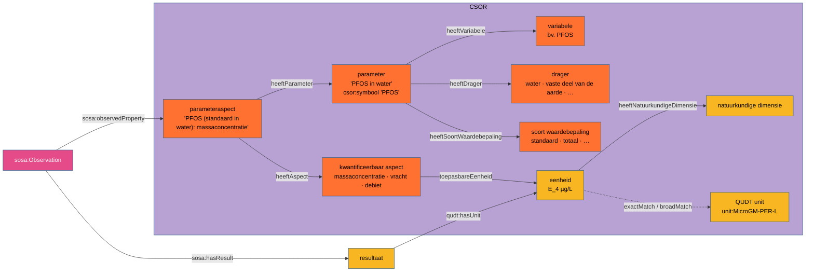

# Codelijsten in de waterkwaliteit-mapping

De SSN/SOSA-mapping van de brondata (`brondata_Jurgen/`) verwijst naar SKOS-codelijsten in plaats
van vrije tekst. Dit document legt vast:

- welke bestaande lijsten hergebruikt worden (CSOR, NACE-BEL);
- hoe de data eraan koppelt, met de controle op de brondata;
- welke nieuwe lijsten nodig zijn;
- welke beslissingen nog open staan.

Alle cijfers zijn nagekeken op de JSON-omzetting van de brondata en de lokale kopieën van de
lijsten (2026-09-29).

---

## 1. Overzicht

| Lijst | Bron | Rol in het SOSA-model | Status |
|---|---|---|---|
| CSOR parameteraspect | `~/git/csor/codelijst-csor-parameteraspect` | `sosa:observedProperty` | bestaat, sluit 100 % aan |
| CSOR parameter | `~/git/csor/codelijst-csor-parameter` | via parameteraspect; ook sleutel vanuit de data (`P_…`) | bestaat, sluit 100 % aan |
| CSOR variabele, drager, soort waardebepaling | `~/git/csor/codelijst-csor-{variabele,drager,soort-waardebepaling}` | facetten van de parameter | bestaat |
| CSOR kwantificeerbaar aspect | `~/git/csor/codelijst-csor-kwantificeerbaar-aspect` | facet van het parameteraspect (concentratie, vracht, debiet …) | bestaat |
| CSOR eenheid (+ natuurkundige dimensie) | `~/git/csor/codelijst-csor-eenheid`, `…-natuurkundige-dimensie` | eenheid van het resultaat | bestaat, sluit 100 % aan |
| CSOR resultaattype, kwalificeerbaar aspect | `~/git/csor/codelijst-csor-{resultaat-type,kwalificeerbaar-aspect}` | type van het resultaat; aantoonbaarheid | bestaat, te bekijken (§3.4) |
| NACE-BEL 2008 / 2025 | `nacebel/nace2008_volledig.trig`, `nacebel/nace2025_volledig.trig` (via `scripts/nace_ophalen.py`) | activiteit van exploitatie of meetput | bestaat; de data gebruikt **2008** |
| Nieuwe lijsten (§4) | nog aan te maken | types van meetput, afvalwater, lozing, monstername, … | voorstel |

---

## 2. Het CSOR-model



Namespaces:
- concepten: `https://data.omgeving.vlaanderen.be/id/concept/csor/<lijst>/<code>`
- schemes: `https://data.omgeving.vlaanderen.be/id/conceptscheme/csor/<lijst>`
- eigenschappen: `https://data.omgeving.vlaanderen.be/ns/csor#`

---

## 3. Koppeling van de brondata aan CSOR

### 3.1 Parameter

| Dataset | Sleutel in de data | Gevonden in CSOR | Eenduidig? |
|---|---|---|---|
| `250108` afvalwater | `Parameter Code` (`P_1005`) = `skos:notation` | 325/325 codes | ja: code en symbool + drager `water` geven voor **1998/1998** rijen dezelfde parameter |
| `250108` afvalwater | `Parameter Symbool` = `csor:symbool` | 325/325 | enkel samen met de drager: 272 symbolen bestaan voor meerdere dragers |
| `250114` oppervlaktewater | `Parameter Symbool` | 647/647 | ja, met drager `water` |
| `240426` PFAS-vrachten | `Symbool` | 5/5 | ja, met drager `water`. `Parameter ID` (`1044`) is **geen** CSOR-notation. |
| `251013` contrastmiddelen | `Parameter Code` (`P_117`) | 3/3 | ja |
| `250124` waterbodem | `Parameter Symbool` | 70/70 | ja, met drager `vaste deel van de aarde` |

**Regel:** een parameter is bepaald door `csor:symbool` + `csor:heeftDrager`. Is een
`P_`-code beschikbaar, dan is die rechtstreeks de sleutel.

### 3.2 `sosa:observedProperty` = CSOR parameteraspect

Een parameteraspect combineert een parameter met een kwantificeerbaar aspect. Daardoor zijn
concentratie, vracht en debiet van dezelfde stof verschillende eigenschappen, zoals SOSA het
verwacht:

- `Amidotriz (standaard in water): massaconcentratie` → `Conc OG` in `251013`
- `Amidotriz (standaard in water): vracht` → `Bruto/Netto Vracht OG` in `251013`
- `Q (standaard in water): debiet` → jaardebiet in `250129` en `Debiet (m³)` in `251013`

Het parameteraspect wordt eenduidig gevonden via de parameter en de eenheid van het resultaat:
het aspect waarvan `csor:toepasbareEenheid` die eenheid bevat.

| Dataset | Combinaties (symbool, eenheid) | Precies één parameteraspect |
|---|---|---|
| `250108` concentraties | 325 | 325 |
| `250114` concentraties | 344 | 344 |
| `240426` vrachten | 5 | 5 |
| `251013` concentraties / vrachten | 3 / 3 | 3 / 3 |
| `250124` waterbodem | 70 | 70 |

**Voorstel:** `sosa:observedProperty` verwijst naar het CSOR-parameteraspect. Dat wordt dan
`sosa:Property` (SOSA 2023), af te leiden uit het bereik van `sosa:observedProperty`, en blijft
tegelijk `skos:Concept`.

Verworpen alternatieven:
- *parameter* als observedProperty: dan zijn concentratie en vracht van dezelfde stof niet te
  onderscheiden;
- *variabele* + drager apart: dat dupliceert wat CSOR al samenstelt.

### 3.3 Eenheid

Alle 25 eenheden uit de brondata bestaan in CSOR (`csor:symbool`):

| Soort | Voorbeelden | QUDT-koppeling in CSOR |
|---|---|---|
| gewone eenheden | `µg/L` (E_4), `mg/L` (E_1), `ng/L` (E_2), `°C` (E_62), `mg` (E_37), `m³` (E_32), `µS/cm` (E_72) | `skos:exactMatch` → `unit:MicroGM-PER-L`, … |
| eenheden "als X" | `mgN/L` (E_103), `mgP/L` (E_131), `mgO2/L` (E_102), `ngSn/L` (E_135), `µg/kg ds` (E_97) | enkel `skos:broadMatch` → `unit:MilliGM-PER-L`, `unit:MicroGM-PER-KiloGM` |
| zonder QUDT-match | `/100mL` (E_54), `meq/L` (E_67), `°F` Franse hardheidsgraden (E_75) | geen. `csor-testing` stelt voor E_67 `unit:MilliEQ-PER-L` voor; E_75 bewust zonder koppeling (QUDT kent geen hardheid); E_54 zonder kandidaat |

De bron gebruikt `m³/jaar`; in CSOR is dat `m³/jr` (E_50, exactMatch `unit:M3-PER-YR`). Voor die
eenheid is dus een label-mapping nodig.

**Voorstel:** `qudt:hasUnit` verwijst naar de **CSOR-eenheid**. De QUDT-eenheid is dan bereikbaar
via `skos:exactMatch` of `skos:broadMatch`. Zo gaat het "als N/P/O2/ds"-element niet verloren.
Een rechtstreekse verwijzing naar QUDT zou voor 12 van de 25 eenheden informatie weggooien (9
met enkel een `broadMatch`) of onmogelijk zijn (3 zonder match). Dit wijkt af van de gewone `unit:`-praktijk in R3 en moet dus bevestigd worden
(§6).

Dit sluit aan bij de CSOR-analyse in `~/git/csor/csor-testing`
(`reports/rapport_conceptschemas_en_qudt.md` §3.4). Volgens die analyse is de `broadMatch` voor
stofgekwalificeerde eenheden verwacht en correct, want QUDT modelleert het "als X"-element niet.
CSOR legt dat wel vast: via `csor:uitgedruktIn` (kwantificeerbaar aspect → variabele N, C, O, P,
S, Cl of F) en via een interne `skos:broader` naar de generieke eenheid. Dat is een extra argument
om naar de CSOR-eenheid te verwijzen en niet rechtstreeks naar QUDT.

### 3.4 Teken en aantoonbaarheid

Het teken `<` staat bij 1605 van de 1998 afvalwaterresultaten en bij 834 van de 999
oppervlaktewaterresultaten. De waarde is dan een rapportagegrens en geen gemeten concentratie.
`250108` geeft daarnaast ook `Resultaat Aantoonbaarheid` en `Resultaat Bepaalbaarheid`.

Opties:
1. een nieuwe lijst **resultaatteken** (`<`, `=`, `>`) als kwalificatie op het resultaat;
2. het CSOR **kwalificeerbaar aspect** `Aantoonbaarheid` gebruiken (de lijst bevat ook
   `Aanwezigheid` en `Sterkte van aanwezigheid`), met een tweede observatie "aanwezig / niet
   aantoonbaar";
3. aantoonbaarheids- en bepaalbaarheidsgrens als eigenschappen van het resultaat, naast een
   teken.

Hierover moet nog beslist worden (§6). Dit hangt samen met de CSOR **resultaattype**-lijst
(`Meting`, `Aantal`, `Classificatie`, `Temporele Observatie`).

### 3.5 Bekende CSOR-kwaliteitspunten die deze mapping raken

`~/git/csor/csor-testing/reports/` analyseert wat er in CSOR nog moet veranderen. Hieronder staat
de impact op de concepten die de waterkwaliteit-brondata gebruikt: 732 parameters, 537
variabelen en 25 eenheden. Die zijn bepaald via de koppeling uit §3.1.

| Bevinding in csor-testing | Rapport | Impact op deze mapping |
|---|---|---|
| Identifier-hergebruik V_2043–V_2240: dezelfde URI kreeg een ander concept, en `view.ttl` is verouderd | `rapport_conceptschema_collectie_semantiek.md` §3.2 | **geen**: 0 van de 537 gebruikte variabelen in dat bereik. Wel een waarschuwing om enkel de actuele `variabele.ttl` te gebruiken en niet `codelijst-csor-view`. |
| InChIKey niet met de juiste stereo-informatie | `rapport_variabele_identiteit.md` | `V_378` beta-Endosulfan (`250114`). Raakt enkel de chemische identificatie, niet de koppeling. |
| EEA-code met storende spatie | `rapport_parameter_inhoud.md` | `V_403` pp'-DDT (`250114`, `250124`). Idem. |
| CAS-nummer op de parameter in plaats van op de variabele | `rapport_parameter_inhoud.md` | `V_47` Koolstof (`250114`). Idem. |
| 7 spelfouten in eenheidslabels (E_104, E_105, E_113, E_130, E_240, E_323, E_328) | `rapport_conceptschemas_en_qudt.md` §3.5 | **geen**: geen van de 25 gebruikte eenheden |
| 195 eenheden zonder QUDT-koppeling; suggesties in `output/tables/eenheid_qudt_suggesties.csv` | idem §3.4, §3.6 | E_54, E_67 en E_75 (zie §3.3) |
| µ (U+00B5, CSOR) tegenover μ (U+03BC, QUDT) | idem §3.4 | Het symbool `µg/L` in de brondata is U+00B5 en matcht het CSOR-symbool. **Niet** op symbool naar QUDT matchen, enkel via `skos:*Match`. |
| 71 parameters zonder parameteraspect | idem §3.3 | **geen**: alle gebruikte parameters hebben een eenduidig parameteraspect (§3.2) |
| Waardenlijsten van kwalificeerbaar aspect nog vrije tekst, niet als SKOS-enumeratie | `rapport_parameter_inhoud.md` aanbeveling 5 | relevant voor §3.4 (teken en aantoonbaarheid), als die route gekozen wordt |

---

## 4. NACE-BEL

De NACE-codes in de brondata zijn **NACE-BEL 2008**. Ze staan met punten genoteerd (`20.160`,
`24.10`, `17.1`), op verschillende niveaus.

| Dataset | Kolom | Gevonden in NACE-BEL 2008 | in NACE-BEL 2025 |
|---|---|---|---|
| `250108` | `NACE Sample Point Code` | 24/24 | 18/24 |
| `250129` | `Meetput NACE Code` | 247/248 (`OB` = onbekend) | 201/248 |

**Koppelregel:** punten weglaten; het resultaat is het laatste padsegment van de IRI
(`20.160` → `http://vocab.belgif.be/auth/nace2008/20160`). De `skos:notation` is daarvoor niet
bruikbaar: in 2008 staat die zonder punt (`20160`), in 2025 met punt (`20.160`).

### 4.1 VMM-sectorindelingen (`Meetput NACE Sector EIW`, `Sector JV`, `Subsector EIW`)

Deze kolommen in `250129` zijn **VMM-eigen groeperingen van NACE-codes**, en zelf geen NACE-codes.
De codes lijken op NACE-afdelingen, maar betekenen iets anders:

| VMM-sector JV | Omvat in de data de NACE-afdelingen | NACE-BEL 2008 met dezelfde code |
|---|---|---|
| `21` Voeding | 10, 11, 12 | `21` Vervaardiging van farmaceutische grondstoffen en producten |
| `24` Chemie | 20, 21 | `24` Vervaardiging van metalen in primaire vorm |
| `25` Metaalnijverheid | 24–29 | `25` Vervaardiging van producten van metaal |

- **Sector JV** (18 waarden, `21` Voeding … `66` Overige diensten, `OB` Onbekend): 17 van de 18
  codes bestaan ook als NACE-ID, maar dat is toeval. Slechts 4 van de 18 namen komen overeen met
  een NACE-label.
- **Sector EIW** (`2` Industrie, `3` Energie, `4` Landbouw, `6` Handel & diensten, `OB`): geen
  enkele code is een NACE-ID; NACE-secties zijn letters.
- **Subsector EIW** (38 waarden, bv. `211` verv. van voeding): verfijning van de EIW-sector.

**De koppeling met NACE is wel eenduidig.** In `250129` hoort elke NACE-code bij precies één
JV-sector, één EIW-sector en één EIW-subsector (248/248). De sector is dus af te leiden uit de
NACE-code van de meetput.

**JV en EIW vormen een hiërarchie.** Het eerste cijfer van de JV-sector is de EIW-sector
(`21`–`27` → `2` Industrie, `31`–`32` → `3` Energie, `41`–`42` → `4` Landbouw, `61`–`66` →
`6` Handel & diensten), zonder uitzondering in de data. Dat kan dus met `skos:broader` binnen één
VMM-sectorlijst.

**Voorstel.** Eigen SKOS-lijsten die met SKOS-mapping-relaties naar NACE-BEL **2008** verwijzen,
waarop de indeling gebaseerd is:

```turtle
vmm-sector-jv:21 a skos:Concept ;
    skos:inScheme vmm-sector-jv: ;
    skos:notation "21" ;
    skos:prefLabel "Voeding"@nl ;
    skos:broader vmm-sector-eiw:2 ;                       # Industrie
    skos:narrowMatch <http://vocab.belgif.be/auth/nace2008/10> ,
                     <http://vocab.belgif.be/auth/nace2008/11> ,
                     <http://vocab.belgif.be/auth/nace2008/12> .
```

- `skos:narrowMatch` naar een NACE-afdeling als de hele afdeling onder de sector valt. Gaat het
  maar om een deel van een afdeling, dan verwijst de relatie naar de fijnere NACE-codes
  (groep, klasse of subklasse).
- Een koppeling met NACE-BEL 2025 kan pas via een omzetting van 2008 naar 2025.
- Uit de data is de koppeling enkel af te leiden voor de 248 NACE-codes die in `250129`
  voorkomen. De volledige indeling moet van de VMM komen, ook om de relatie tussen JV, EIW en
  subsector te bevestigen.
- Omdat dit bedrijfskenmerken zijn, valt het volgens de afgesproken scope pas in fase 3
  (zie `brondata_Jurgen/README.md` en `stappenplan.md`).

---

## 5. Nieuwe SKOS-lijsten

Kolommen met een vaste, kleine waardenset worden een `skos:ConceptScheme`. De waarden hieronder
zijn alle waarden die in de brondata voorkomen.

| Voorgestelde lijst | Bronkolommen | Waarden in de brondata | Gebruik in het SOSA-model |
|---|---|---|---|
| **soort monstername** | `250108` `Aard Monstername` | Schepmonster, Debietgebonden monster | `sosa:usedProcedure` van de `sosa:Sampling` (procedure van de staalname) |
| **meetputtype** (type sample point) | `250108` `Type Code`/`Omschrijving`; `251013` `SP Type Code`/`Omschrijving`; `250129` `Meetput Type` | COLL Collector, KAH Kunstmatige afvoer hemelwater, OPPW Oppervlaktewater, RIO Riool, IRWZI Influent RWZI, Grondwater (zonder code) | `dct:type` van het meetpunt (`sosa:SpatialSample`/`sosa:Platform`) |
| **soort afvalwater** | `250108` `Bedrijfsafvalwater`, `Huishoudelijk Afvalwater`, `Koelwater`, `Hemelwater` (0/1); `250129` idem met `Regenwater` | bedrijfsafvalwater, huishoudelijk afvalwater, koelwater, hemelwater | meervoudig `dct:type` van het afvalwater (FOI) dat bij het meetpunt geloosd wordt. De vier 0/1-vlaggen worden vier concepten. |
| **afvoertype DWA/RWA** | `250108` `DWH - RWA`/`Omschrijving`; `250129` `Meetput RWA Code` (0/1) | DWA Droogweerafvoer, RWA Regenweerafvoer, NVT Niet van toepassing | kenmerk van het meetpunt |
| **lozingswijze** | `250108` `Lozingswijze`/`Omschrijving` | OW DIR rechtstreeks op oppervlaktewater, OW INDIR via riool op oppervlaktewater, Onbekend | kenmerk van het lozingspunt |
| **lozingstype** | `250108` `Lozingstype`; `250129` `Meetput Lozingstype` | Lozend | kenmerk van het lozingspunt; slechts één waarde, de volledige lijst opvragen |
| **positie in de zuivering** | `250108` `Influent - Effluent - Andere`, `Effluent RWZI` (0/1) | Influent, Effluent, Andere | kenmerk van het meetpunt; overlapt met meetputtype `IRWZI` |
| **herkomst staal** | `250108` `Sample Type Staal Code`/`Omschrijving` | BEDR Staal Bedrijf, VMM Staal VMM | wie de staalname uitvoerde: te bekijken of dit een `sosa:Sampler`/`prov:Agent` wordt in plaats van een codelijst |
| **matrix** | `250108` `Matrix` | Afvalwater | fijner dan de CSOR-drager `water`; typering van het FOI. Nagaan of een bestaande lijst volstaat. |
| **databron** | `250129` `Databron Jaardebiet` | IMJV, MNT | provenance van het jaardebiet (`prov:wasDerivedFrom` / `dct:source`) |
| **categorie lozer** | `251013` `Bedrijven/RWZI` | Bedrijven, RWZI | groepering van de vrachtberekening (FOI-type) |
| **bevestigingscode** | `250108` `Bevestiging Code` | R | betekenis navragen |
| *later:* **normtype** | `250124` `Type` | Vlarem, Trigger | normen en beoordelingen (fase 2) |
| *later:* **toetswijze** | `250124` `Toetswijze Code` | MAX, MIN | idem |
| *later:* **beoordeling** | `250124` `Beoordeling` | goed, niet goed, geen beoordeling | idem |

Voor elke lijst moet nog de volledige waardenset bij de VMM opgevraagd worden. De brondata bevat
enkel de waarden die in deze uittreksels voorkomen.

---

## 6. Open beslissingen

| # | Vraag | Voorstel |
|---|---|---|
| 1 | observedProperty = CSOR-parameteraspect? | ja (§3.2) |
| 2 | `qudt:hasUnit` → CSOR-eenheid of QUDT-eenheid? | CSOR-eenheid, met QUDT via `skos:*Match` (§3.3); afwijking van R3 bevestigen. Ontbrekende QUDT-koppelingen (E_54, E_67) aanvullen in CSOR, niet in dit voorbeeld. |
| 3 | Hoe het teken `<` en de aantoonbaarheid modelleren? | te beslissen (§3.4) |
| 4 | IRI's voor de nieuwe lijsten | naar het CSOR-patroon, bv. `https://data.omgeving.vlaanderen.be/id/conceptscheme/<lijst>` en `…/id/concept/<lijst>/<code>`. In het datavoorbeeld `https://example.org/waterkwaliteit/…` zolang ze niet gepubliceerd zijn (R10). |
| 5 | NACE 2008 of 2025? | de data gebruikt 2008. Koppelen aan 2008; 2025 pas als er een mapping 2008 → 2025 is. |
| 6 | Herkomst staal: codelijst of agent? | eerder agent (`sosa:Sampler`), te bespreken |

---

## 7. Werken met de lijsten in deze pipeline

- **Niet als `.ttl` onder `src/main/input/` zetten.** De CSOR-lijsten zijn groot
  (`parameter.ttl` 10,5 MB, `parameteraspect.ttl` 7,5 MB). Ze gebruiken ook `csor:`-eigenschappen
  die niet in `src/main/resources/` zitten, wat `[VOCAB ERROR]`s zou geven. De datavoorbeelden
  verwijzen enkel naar de concept-IRI's.
- Is een lokaal uittreksel nodig, bijvoorbeeld alle gebruikte parameteraspecten met hun eenheid,
  voor documentatie of JSON-LD-framing? Sla het dan op als `.trig`, zoals
  `nacebel/*_volledig.trig`.
- De koppeling in §3 is reproduceerbaar met een SPARQL- of rdflib-query over
  `~/git/csor/codelijst-csor-*/src/main/resources/…/conceptscheme/csor/<lijst>/<lijst>.nt`,
  analoog aan `~/git/csor/parameter_parameteraspect_aspect_eenheid.rq`.
